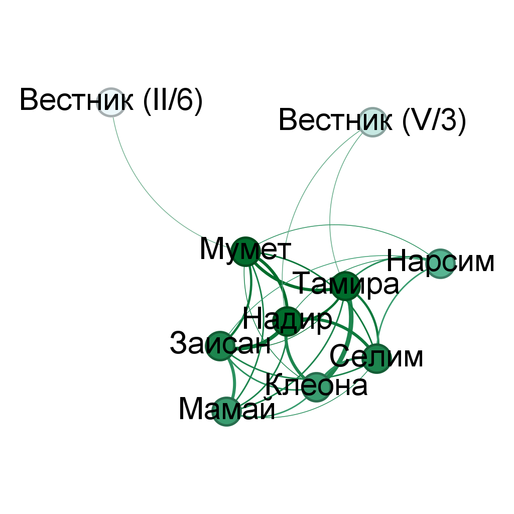
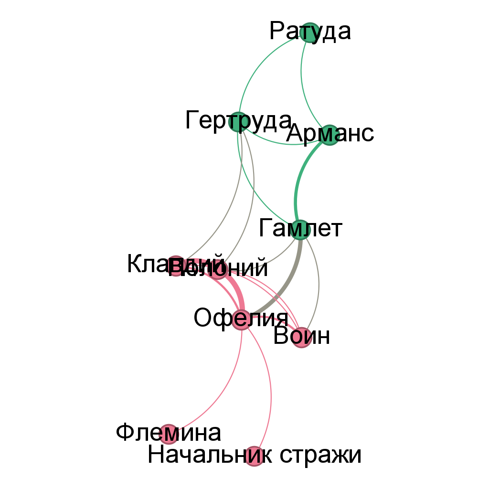
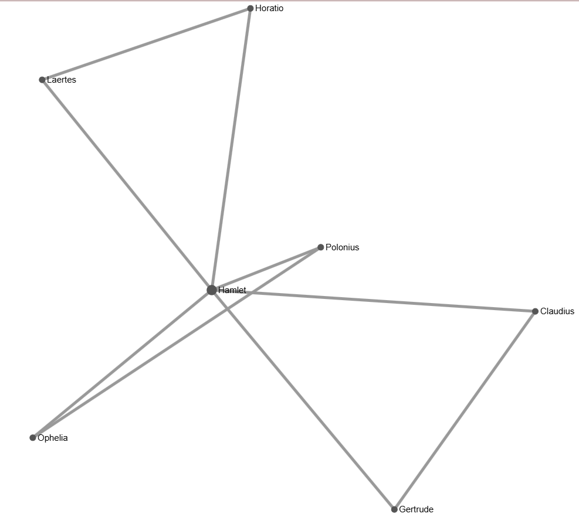

# Лабораторная работа №9  
Сетевой анализ драматических произведений  

В данной работе был выполнен анализ взаимодействий персонажей в драматических произведениях с помощью программы Gephi.  
Было построено два графа, каждый из которых отражает структуру связей между персонажами.  

---

## Ссылки на графы

Граф 1 (Тамира и Селим):  
https://stepl1y.github.io/network-graph/

Граф 2 (Гамлет):  
https://stepl1y.github.io/network-graph/index2.html

---

## Ход работы

Сначала были подготовлены данные по персонажам и их взаимодействиям.  
Затем графы были построены в Gephi с использованием алгоритма ForceAtlas2 для более наглядного расположения узлов.  

После этого была выполнена настройка визуализации:
- размер узлов задавался в зависимости от степени  
- цвет использовался для разделения персонажей  
- толщина рёбер отражала силу взаимодействия  

Готовые графы были экспортированы в виде изображений и размещены на GitHub Pages.  

---

## Скриншоты

Граф 1:  

Граф 2:  

---

## Ответы на вопросы

1. Графы различаются структурой связей и плотностью взаимодействий. В одном графе связи распределены более равномерно, в другом явно выделяются центральные персонажи.  

2. В обоих произведениях преобладают мужские персонажи.  

3. Наибольшее количество взаимодействий наблюдается у главных героев (например, Гамлет), наименьшее — у второстепенных персонажей.  

4. Больше всего контактов у центральных персонажей, так как они взаимодействуют с большинством других. Меньше всего — у второстепенных.  

5. Анализ графа позволяет выявить связи между персонажами, которые не всегда очевидны при обычном чтении текста.  

6. Наибольшей центральностью обладают главные герои, так как через них проходит большинство взаимодействий.  

---

## Вывод

Сетевой анализ позволяет лучше понять структуру произведения и роль персонажей в нём.  

---

Дополнительное задание (Easy Linavis):

Граф:

Отчёт:
[Скачать отчёт](lab9_network_analysis.docx)

Выполнил: Ананских Максим
